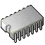
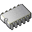
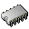
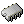

# Mimes
Only the main icons are shown here (without symlinked duplicates, in sizes from 16x16 to 64x64). The full icon list with sizes from 16x16 to 96x96 is there: [icons.md](icons.md)

| |**64x64**|**48x48**|**32x32**|**24x24**|**22x22**|**16x16**|
|-|-|-|-|-|-|-|
|**application-7zip**|||||||
|**application-certificate**|||||||
|**application-epub+zip**|||||||
|**application-gzip**|||||||
|**application-install**|||||||
|**application-javascript**|||||||
|**application-ms-htmlhelp**|||||||
|**application-octet-stream**|||||||
|**application-octet-stream_SHARP**|||||||
|**application-octet-stream_SMOOTH**|||||||
|**application-pdf**|||||||
|**application-pgp**|||||||
|**application-pgp-keys**|||||||
|**application-rss+xml**|||||||
|**application-vnd.android.package-archive**|||||||
|**application-vnd.debian.binary-package**|||||||
|**application-vnd.iccprofile**|||||||
|**application-vnd.nintendo.snes.rom**|||||||
|**application-vnd.nokia.qt.qmakeprofile**|||||||
|**application-vnd.nokia.xml.qt.resource**|||||||
|**application-vnd.oasis.opendocument.chart**|||||||
|**application-vnd.oasis.opendocument.database**|||||||
|**application-vnd.oasis.opendocument.formula**|||||||
|**application-vnd.oasis.opendocument.graphics**|||||||
|**application-vnd.oasis.opendocument.presentation**|||||||
|**application-vnd.oasis.opendocument.spreadsheet**|||||||
|**application-vnd.oasis.opendocument.text**|||||||
|**application-vnd.scribus**|||||||
|**application-x-001**|||||||
|**application-x-7z**|||||||
|**application-x-7zip**|||||||
|**application-x-abiword**|||||||
|**application-x-alpm-package**|||||||
|**application-x-apfs**|||||||
|**application-x-apple-diskimage**|||||||
|**application-x-archive**|||||||
|**application-x-arj**|||||||
|**application-x-awk**|||||||
|**application-x-bittorrent**|||||||
|**application-x-bz2**|||||||
|**application-x-bzip2**|||||||
|**application-x-cab**|||||||
|**application-x-cd-image**|||||||
|**application-x-class-file**|||||||
|**application-x-compress**|||||||
|**application-x-cpio**|||||||
|**application-x-csproj**|||||||
|**application-x-dmg**|||||||
|**application-x-esd**|||||||
|**application-x-executable**|||||||
|**application-x-fat**|||||||
|**application-x-gamecube-rom**|||||||
|**application-x-genesis-rom**|||||||
|**application-x-glade**|||||||
|**application-x-gpx**|||||||
|**application-x-gz**|||||||
|**application-x-gzip**|||||||
|**application-x-hfs**|||||||
|**application-x-iz**|||||||
|**application-x-java**|||||||
|**application-x-lha**|||||||
|**application-x-lzh**|||||||
|**application-x-lzip**|||||||
|**application-x-lzma**|||||||
|**application-x-ms-dos-executable**|||||||
|**application-x-ms-shortcut**|||||||
|**application-x-ms-shortcut_SHARP**|||||||
|**application-x-ms-shortcut_SMOOTH**|||||||
|**application-x-msdownload**|||||||
|**application-x-mswinurl**|||||||
|**application-x-nes-rom**|||||||
|**application-x-ntfs**|||||||
|**application-x-ole-storage**|||||||
|**application-x-openvpn-profile**|||||||
|**application-x-partial-download**|||||||
|**application-x-perl**|||||||
|**application-x-php**|||||||
|**application-x-python-bytecode**|||||||
|**application-x-rar**|||||||
|**application-x-raw-disk-image**|||||||
|**application-x-riff**|||||||
|**application-x-rpm**|||||||
|**application-x-ruby**|||||||
|**application-x-sharedlib**|||||||
|**application-x-shockwave-flash**|||||||
|**application-x-sln**|||||||
|**application-x-sqlite2**|||||||
|**application-x-sqlite3**|||||||
|**application-x-squashfs**|||||||
|**application-x-stuffit**|||||||
|**application-x-swm**|||||||
|**application-x-tar**|||||||
|**application-x-taz**|||||||
|**application-x-tbz**|||||||
|**application-x-tbz2**|||||||
|**application-x-tgz**|||||||
|**application-x-tpz**|||||||
|**application-x-trash**|||||||
|**application-x-txz**|||||||
|**application-x-tzst**|||||||
|**application-x-vhd**|||||||
|**application-x-vhdx**|||||||
|**application-x-wim**|||||||
|**application-x-xar**|||||||
|**application-x-xz**|||||||
|**application-x-z**|||||||
|**application-x-zip**|||||||
|**application-x-zst**|||||||
|**ascii**|||||||
|**audio-aac**|||||||
|**audio-flac**|||||||
|**audio-midi**|||||||
|**audio-prs.sid**|||||||
|**audio-x-generic**|||||||
|**audio-x-it**|||||||
|**audio-x-mod**|||||||
|**audio-x-mpeg**|||||||
|**audio-x-playlist**|||||||
|**audio-x-s3m**|||||||
|**audio-x-vorbis+ogg**|||||||
|**audio-x-wav**|||||||
|**audio-x-xm**|||||||
|**authors**|||||||
|**binary**|||||||
|**contents2**|||||||
|**empty**|||||||
|**encrypted**|||||||
|**exec**|||||||
|**extension**|||||||
|**font-otf**|||||||
|**font-ttf**|||||||
|**font-x-generic**|||||||
|**gnome-fs-executable**|||||||
|**gnome-mime-application-x-class-file**|||||||
|**gnome-mime-application-x-executable**|||||||
|**gnome-mime-text-x-credits**|||||||
|**gnome-mime-text-x-csharp**|||||||
|**gnome-mime-text-x-java**|||||||
|**gnome-mime-text-x-java-source**|||||||
|**gnome-mime-text-x-vcard**|||||||
|**gtk-file**|||||||
|**image**|||||||
|**image-bmp**|||||||
|**image-icon-project**|||||||
|**image-jpeg**|||||||
|**image-svg+xml**|||||||
|**image-tiff**|||||||
|**image-x-portable-bitmap**|||||||
|**image-x-psd**|||||||
|**image-x-tga**|||||||
|**image-x-xcf**|||||||
|**image-x-xcursor**|||||||
|**inode-chardevice**|||||||
|**inode-socket**|||||||
|**inode-symlink**|||||||
|**inode-x-generic**|||||||
|**libreoffice-database**|||||||
|**libreoffice-oasis-database**|||||||
|**message**|||||||
|**model-x-generic**|||||||
|**office-contact**|||||||
|**package-x-generic**|||||||
|**phatch-actionlist**|||||||
|**plan**|||||||
|**stock_addressbook**|||||||
|**text-directory**|||||||
|**text-html**|||||||
|**text-rtf**|||||||
|**text-tcl**|||||||
|**text-vcard**|||||||
|**text-x-authors**|||||||
|**text-x-bibtex**|||||||
|**text-x-c++hdr**|||||||
|**text-x-c++src**|||||||
|**text-x-common-lisp**|||||||
|**text-x-credits**|||||||
|**text-x-csharp**|||||||
|**text-x-csrc**|||||||
|**text-x-css**|||||||
|**text-x-emacs-lisp**|||||||
|**text-x-generic**|||||||
|**text-x-gettext-translation**|||||||
|**text-x-install**|||||||
|**text-x-java**|||||||
|**text-x-log**|||||||
|**text-x-lua**|||||||
|**text-x-ms-regedit**|||||||
|**text-x-python**|||||||
|**text-x-qml**|||||||
|**text-x-script**|||||||
|**text-x-sql**|||||||
|**text-x-ssa**|||||||
|**text-x-tex**|||||||
|**text-xml**|||||||
|**vcard**|||||||
|**video-mp2t**|||||||
|**video-mp4**|||||||
|**video-webm**|||||||
|**video-x-anim**|||||||
|**video-x-avi**|||||||
|**video-x-flic**|||||||
|**video-x-flv**|||||||
|**video-x-generic**|||||||
|**video-x-matroska**|||||||
|**video-x-mov**|||||||
|**video-x-mpeg**|||||||
|**video-x-wmv**|||||||
|**x-dia-diagram**|||||||
|**x-office-address-book**|||||||
|**x-office-document-rtl**|||||||
